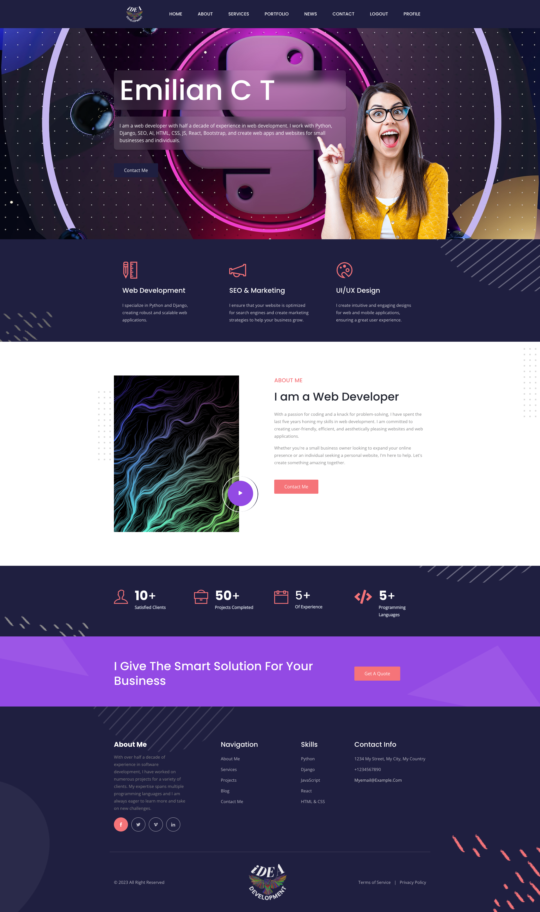
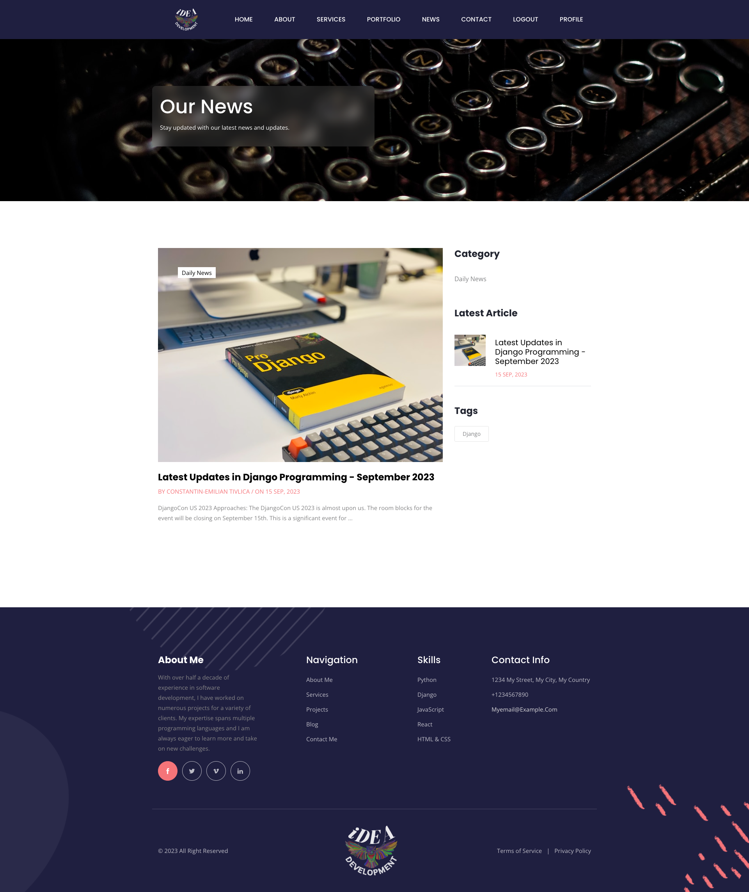

# Emil's Portfolio 🚀

Welcome to the source code of [my personal portfolio](https://emilian-portfolio.onrender.com/)! This is a full-stack web application built with Django, JavaScript, HTML, CSS, and Bootstrap. It's fully customizable, featuring an admin page, registration system, blog, and dynamic pricing set directly from the admin page. This is the place where I showcase my projects, skills, and experiences. Feel free to explore the code and get inspired.

## 🌟 Features

- **Responsive Design**: Optimized for mobile, tablet, and desktop.
- **Dynamic Content**: Powered by Django, the website is dynamic and can be easily updated.
- **AWS Integration**: Uses AWS S3 for media and static file storage.
- **PostgreSQL Database**: Robust database setup for production.
- **Interactive UI**: Modern and interactive user interface.
- **Admin Dashboard**: Manage content, prices, and more directly from the admin page.
- **User Registration**: Integrated user registration and authentication system.
- **Blog**: Share updates, news, and articles with the integrated blog system.

## 🛠️ Built With

- [Django](https://www.djangoproject.com/)
- [JavaScript](https://www.javascript.com/)
- [HTML](https://developer.mozilla.org/en-US/docs/Web/HTML)
- [CSS](https://developer.mozilla.org/en-US/docs/Web/CSS)
- [Bootstrap](https://getbootstrap.com/)
- [AWS S3](https://aws.amazon.com/s3/)
- [PostgreSQL](https://www.postgresql.org/)
- [Whitenoise](http://whitenoise.evans.io/en/stable/)
- ... and more! Check out the `requirements.txt` for a full list.

## 🚀 Deployment

The website is hosted on [Render](https://render.com/), ensuring smooth performance and uptime.

## 🖼️ Screenshots

  
Click to expand!

  
  
  
  

## 📝 License

This project is open source under the MIT license.

## 🤝 Contributing

While this is a personal project, I'm open to contributions, issues, and feature requests. Feel free to open an issue to discuss any suggestions or improvements.

## 📞 Contact

For any inquiries or collaborations, reach out to me through the [contact form](https://emilian-portfolio.onrender.com/contact) on my website.

## 🌟 Star the Repo

If you find this repo helpful, give it a star! It might not seem like much, but it's the easiest way to thank me.

## ⚠️ Note

This project is still under active development. More updates and improvements are on the way. Stay tuned!
